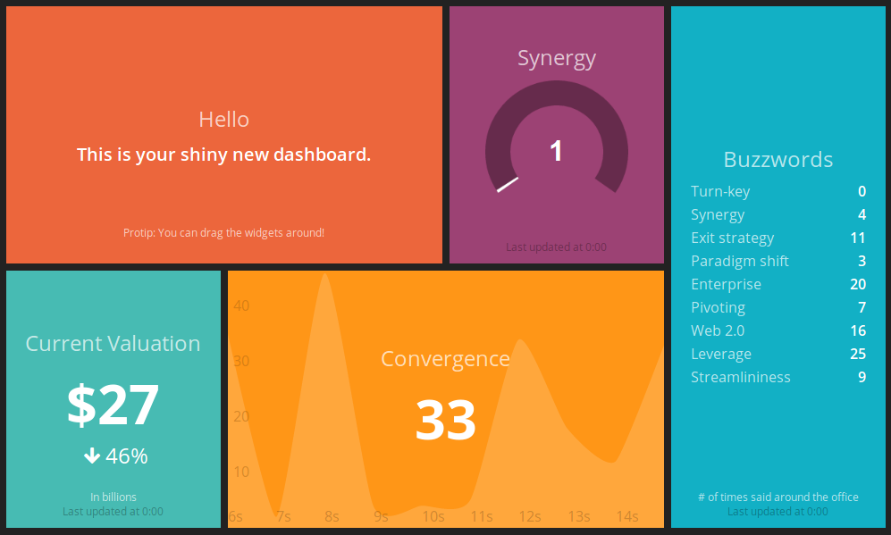

# ") Blashing

> A port/rewrite of Dashing / Smashing in Blazor

> Build a beautiful dashboard

 <!-- https://opensource.org/licenses/MIT -->

Inspired by [Dashing](https://github.com/Shopify/dashing) [Smashing](https://github.com/Smashing/smashing)

## Todo

Add widgets for:

- clock
- comments
- graph
- iframe
- image
- list
- meter
- number
- text

<!--  -->

## Tests

`cd src`

`dotnet test --collect:"XPlat Code Coverage"`

## Reports

- [gist](https://gist.github.com/AlexHedley/867fcfe2ac7154c6b610c8189adac06c)

## src

- [src](src/)

## Sample

Ran the example [smashing](https://github.com/Smashing/smashing) locally and took a copy of the served webpage for comparison.

- [sample](index.html)

## Docs

- [docs](docs/README.md)
